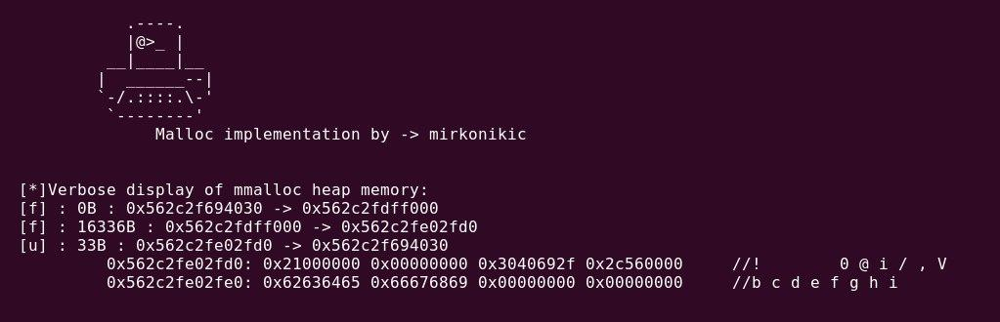

# mmalloc(size_t size)
Memory management project, malloc heap implementation

**Display**
---



**Usage**
---

```
Usage:      
Include the library first with:  #include "mmalloc.h"
After previously mentioned action, you can call following functions respectively:
            InitMmalloc();
            void *buffer = Mmalloc(size_t size);
            MFree(buffer);
            PrintMmallocFreeList();
```

todo:<br>
- [x] finish mmalloc, free, print_heap, memadd<br>
- [x] pass all tests: +test1, +test2, +test3, +test4
- [ ] implement mcalloc(n, size)<br>
- [ ] implement error-checking<br>
- [ ] implement bfree(p, n)<br>
- [ ] implement garbage-collection<br>
- [ ] find a way to implement several algorithms and types of heap management and a way to choose/switch between them<br>
&nbsp;&nbsp;&nbsp;&nbsp;&nbsp;couple of ideas: <br>
            &nbsp;&nbsp;&nbsp;&nbsp;&nbsp;&nbsp;mmalloc_bf //best fit or mmalloc_ff //first fit...<br>
            &nbsp;&nbsp;&nbsp;&nbsp;&nbsp;&nbsp;mmalloc(n, algorithm)<br>
            &nbsp;&nbsp;&nbsp;&nbsp;&nbsp;&nbsp;#define __MMALLOC_BEST_FIT__<br>
            &nbsp;&nbsp;&nbsp;&nbsp;&nbsp;&nbsp;#include "mmalloc_bf_ilt.h"  //mmalloc | best-fit algorithm | implicit-list-type structure<br>
- [ ] implement jemalloc, ptmalloc, dlmalloc...
